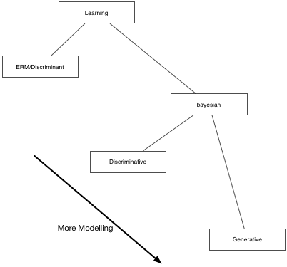

autoscale: true

#[fit] Generative Models

---

#[fit]CLASSIFICATION

- will a customer churn?
- is this a check? For how much?
- a man or a woman?
- will this customer buy?
- do you have cancer?
- is this spam?
- whose picture is this?
- what is this text about?[^j]

[^j]:image from code in http://bit.ly/1Azg29G

---

# PROBABILISTIC CLASSIFICATION

In any machine learning problem we want to model $$p(x,y)$$.

---

We can choose to model as

$$p(x,y) = p(y \mid x) p(x)$$ or $$p(x \mid y) p(y)$$

In regression we modeled the former. In logistic regression, with $$y=c$$ (class $$c$$) we model the former as well. This is the probability of the class given the features $$x$$.

In "Generative models" we model the latter, the probability of the features fiven the class.

---

The conditional probabilities of $$y=1$$ or $$y=0$$ given a particular sample's features $$\renewcommand{\v}[1]{\mathbf #1} \v{x}$$ are:

$$\begin{eqnarray}
\renewcommand{\v}[1]{\mathbf #1}
P(y=1 | \v{x}) &=& h(\v{w}\cdot\v{x}) \\
P(y=0 | \v{x}) &=& 1 - h(\v{w}\cdot\v{x}).
\end{eqnarray}$$

These two can be written together as

$$\renewcommand{\v}[1]{\mathbf #1} P(y|\v{x}, \v{w}) = h(\v{w}\cdot\v{x})^y \left(1 - h(\v{w}\cdot\v{x}) \right)^{(1-y)} $$

BERNOULLI!!

---
[.autoscale: true]

Multiplying over the samples we get:

$$\renewcommand{\v}[1]{\mathbf #1} P(y|\v{x},\v{w}) = P(\{y_i\} | \{\v{x}_i\}, \v{w}) = \prod_{y_i \in \cal{D}} P(y_i|\v{x_i}, \v{w}) = \prod_{y_i \in \cal{D}} h(\v{w}\cdot\v{x_i})^{y_i} \left(1 - h(\v{w}\cdot\v{x_i}) \right)^{(1-y_i)}$$

Indeed its important to realize that a particular sample can be thought of as a draw from some "true" probability distribution.

 **maximum likelihood** estimation maximises the **likelihood of the sample y**, or alternately the log-likelihood,

$$\renewcommand{\v}[1]{\mathbf #1} {\cal L} = P(y \mid \v{x},\v{w}).$$ OR $$\renewcommand{\v}[1]{\mathbf #1} \ell = log(P(y \mid \v{x},\v{w}))$$

---

Thus

$$\renewcommand{\v}[1]{\mathbf #1} \begin{eqnarray}
\ell &=& log\left(\prod_{y_i \in \cal{D}} h(\v{w}\cdot\v{x_i})^{y_i} \left(1 - h(\v{w}\cdot\v{x_i}) \right)^{(1-y_i)}\right)\\
                  &=& \sum_{y_i \in \cal{D}} log\left(h(\v{w}\cdot\v{x_i})^{y_i} \left(1 - h(\v{w}\cdot\v{x_i}) \right)^{(1-y_i)}\right)\\
                  &=& \sum_{y_i \in \cal{D}} log\,h(\v{w}\cdot\v{x_i})^{y_i} + log\,\left(1 - h(\v{w}\cdot\v{x_i}) \right)^{(1-y_i)}\\
                  &=& \sum_{y_i \in \cal{D}} \left ( y_i log(h(\v{w}\cdot\v{x})) + ( 1 - y_i) log(1 - h(\v{w}\cdot\v{x})) \right )
\end{eqnarray}$$

---

#DISCRIMINATIVE CLASSIFIER
$$P(y|x): P(male | height, weight)$$

---

## Discriminative Learning

- are these classifiers any good?
- they are discriminative and draw boundaries, but thats it
- they are cheaper to calculate but shed no insight
- would it not be better to have a classifier that captured the generative process

---

## Throwing darts, uniformly

Throwing darts at the wall to find P(A|B). (a) Darts striking the wall. (b) All the darts in either A or B. (c) The darts only in B. (d) The darts that are in the overlap of A and B.

(pics like these from Andrew Glassner's book)

---

# Conditional Probability

conditional probability tells us the chance that one thing will happen, given that another thing has already happened. In this case, we want to know the probability that our dart landed in blob A, given that we already know it landed in blob B.

---

## Other conditional and joint

Left: the other conditional

Below: the joint probability $$p(A, B)$$, the chance that any randomly-thrown dart will land in both A and B at the same time.

---

## The joint probability can be written 2 ways

---

# Bayes Theorem

Equating these gives us Bayes Theorem.

$$P(A \mid B) P(B) = P(B \mid A) P(A)$$

$$P(A \mid B)  = \frac{P(B \mid A) P(A)}{P(B)}$$

the LHS probability $$P(A \mid B)$$is called the posterior, while P(A) is called the prior, and p(B) is called the evidence

---

#GENERATIVE CLASSIFIER
$$P(y|x) \propto P(x|y)P(x): P(height, weight | male) \times P(male)$$

---

## Generative Classifier

For a feature vector $$x$$, we use Bayes rule to express the posterior of the class-conditional as:

$$p(c \vert x, \theta) = \frac{p(c  \vert  \theta)p(x  \vert  c, \theta)}{ \sum_{c′} p(z c′  \vert  \theta) p(x  \vert  c′, \theta)}$$

This is a **generative classifier**, since it specifies how to generate the data using the class-conditional density $$p(x \vert c, \theta)$$ and the class prior $$p(c\vert \theta)$$.

---

## Representation Learning

- the idea of generative learning is to capture an underlying representation (compressed) of the data
- in the previous slide it was 2 normal distributions
- generally more complex, but the idea if to fit a "generative" model whose parameters represent the process
- besides gpus and autodiff , this is the third pillar of the AI rennaissance: the choice of better representations: e.g. convolutions

---

## Generative vs Discriminative classifiers

- LDA vs logistic respectively.
- LDA is generative as it models $$p(x | c)$$ while logistic models $$p( c | x)$$ directly. Here think of $$\mathbf{z} = c$$
- we do know $$c$$ on the training set, so think of the unsupervised learning counterparts of these models where you dont know $$c$$

---

## Generative vs Discriminative classifiers (contd)

- generative handles data asymmetry better
- sometimes generative models like LDA and Naive Bayes are easy to fit. Discriminative models require convex optimization via Gradient descent
- can add new classes to a generative classifier without retraining so better for online customer selection problems
- generative classifiers can handle missing data easily
- generative classifiers are better at handling unlabelled training data (semi-supervized learning)
- preprocessing data is easier with discriminative classifiers
- discriminative classifiers give generally better callibrated probabilities
- discriminative usually less expensive

---

